Set up the camera
=========================

Set up the Sony DSC-RX1 camera
------------------------------------------

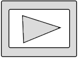

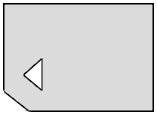

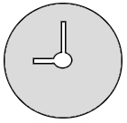

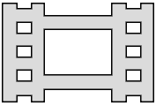

Read the camera's full operating instructions to know about main control elements before make settings.

* Set mode dial in **S** (Shutter Priority) position.
* Use control dial to set exposition **1/800**.
* Set exposure compensation dial in **0** (zero) position.
* Set macro switching ring in **0,3m-∞** position.
* Set focus mode dial in **MF** position.

Press **MENU** button to see settings menu and set this parameters:

* In still shooting menu |icon_cam| (tab 1) set **Image Size** - **L24M**, **Aspect Ratio** - **3:2**, **Quality** – **Fine**.

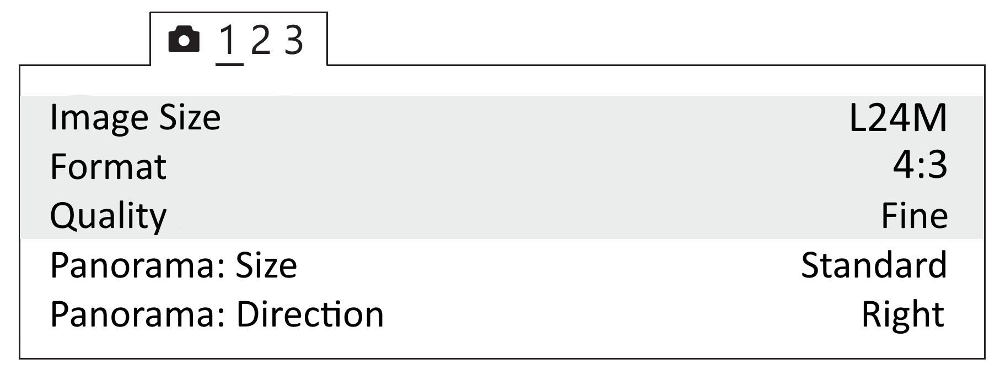

   Still shooting parameters

* In custom menu |icon_set| (tab 1) set **Auto preview** - **Off**.

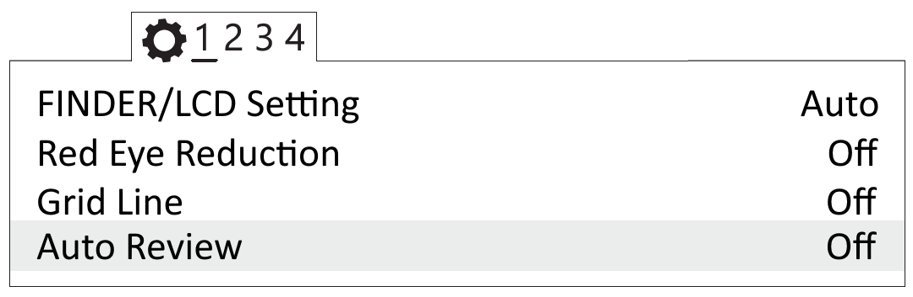

   Auto Review off

* In tab 2 set **MF Assist** - **Off** and **Focus Magnif. Time** - **No limit**.

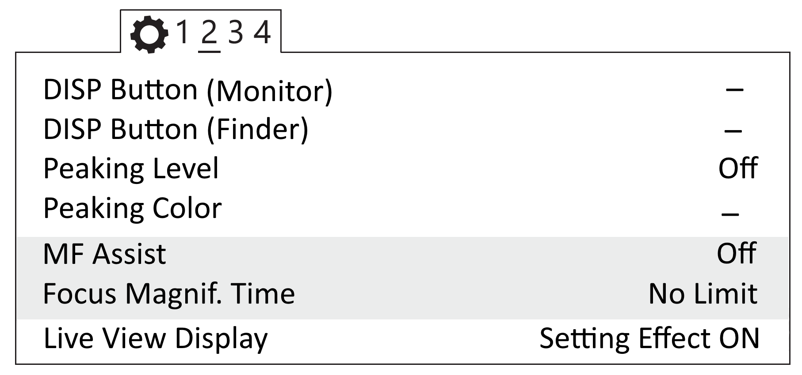

   MF Assist is off and Focus Magnif. Time 

* In tab 3 set **MOVIE Button** - **Movie Mode Only**.

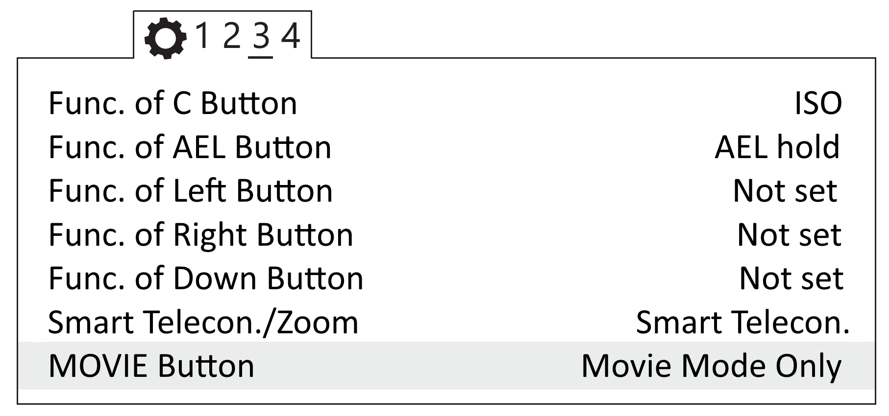

   Set mode movie mode only for MOVIE button

* In setup menu |icon_key| set **Power Saving Start Time** - **30 min** (tab 2). 

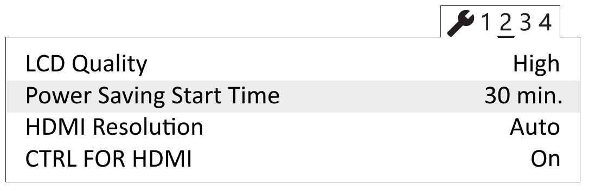

   Power Saving Start Time

* In memory card tool menu |icon_sd| set **File number** - **Reset**.

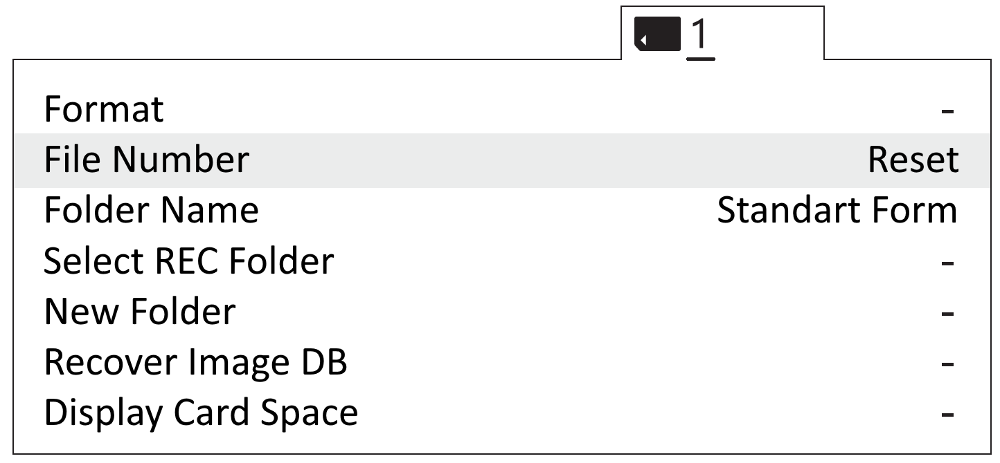

   File number reset

* Press **Fn** (Function) button to set these settings:

.. csv-table:: 
   :align: center
   
   "**Drive Mode**", "**Single Shooting**"
   "**White Balance**", "**Auto AWB**"

Select **ISO** - **Auto** and set:

.. csv-table:: 
   :align: center
   
   "**ISO Minimum**", "**100**"
   "**ISO Maximum**", "**1600**"

Keep default parameters for other camera settings.

**Format SD card**

1) Select **MENU →** |icon_sd| [SD Card] **→ Format**

.. attention::  All data will be deleted!

**Reset** 

To reset all settings set:

1) Select **MENU →** |icon_key| [Settings] **→ Initialize  → Reset Default**

.. attention::  Do not remove the battery while resetting the settings!

2) Set date and time after reset. Camera settings will not be saved, if you skiped that action.
3) Use ON/OFF switcher to turn off the camera. 
4) Do not disconnect the camera from AC or battery for 3 minutes to save the settings in the internal memory.

.. important:: The camera can display the message E: 61: 00. It means that the camera is focused on maximum range. The camera still works correctly.

Set up the Sony A6000 camera
------------------------------------

Read the camera's full operating instructions to know about main control elements before you change any settings.

* Set the mode dial to **S** (Shutter Priority).

Use the control wheel to set the following parameters:

.. csv-table:: 
   :align: center 

   "**Exposition**", "**1/800**"
   "**ISO**", "**Auto**"

* In still shooting menu |icon_cam| (tab 2) set **Focus Mode** - **Manual focus**.

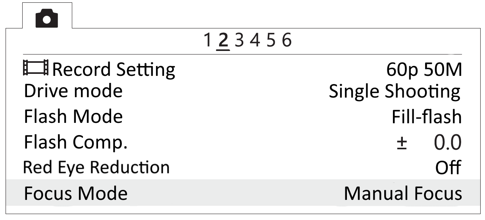

   Focus Mode

* In custom settings menu |icon_set| (tab 1) disable **Automatic preview**.

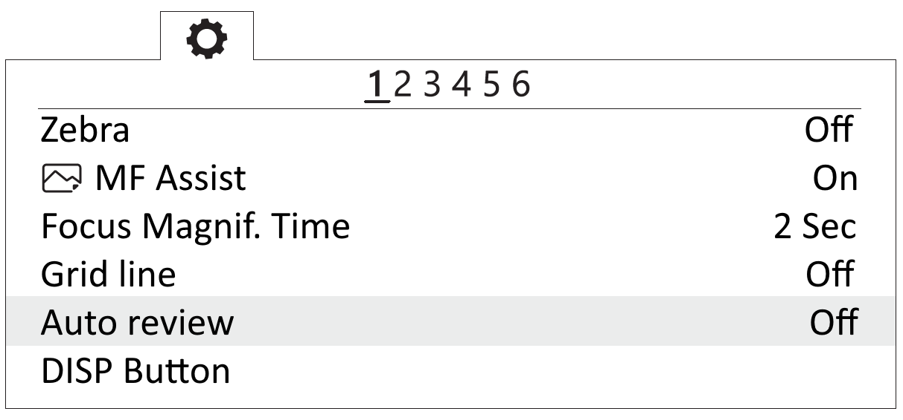

   Automatic preview off

* In custom settings menu |icon_set| (tab 3) turn on **Lens-less Shutter**.

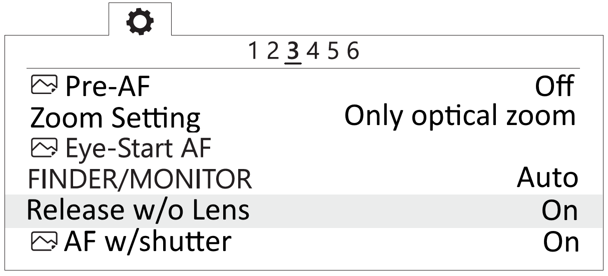

   Turn on the shutter without a lens

* In custom Settings menu |icon_set| (tab 6) set the **MOVIE** button - **Video mode only**.

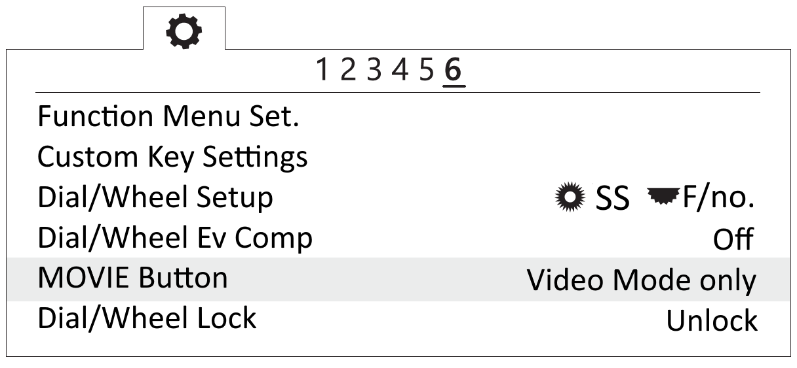

   Set "Video Mode Only"

* In setup menu |icon_bag| (tab 2) set **Start time energy saving** - **30 min**.

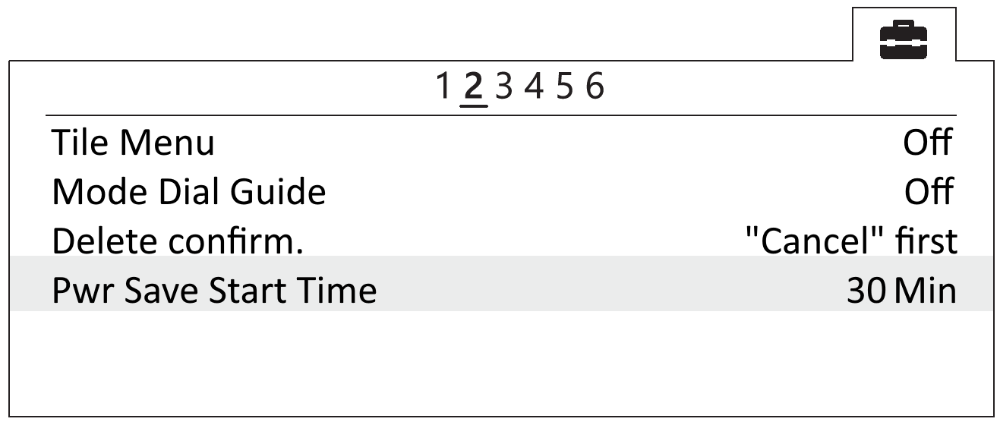

   Set the time to start energy saving

* In setup menu |icon_bag| (tab 5) set **File Number** - **Reset**.

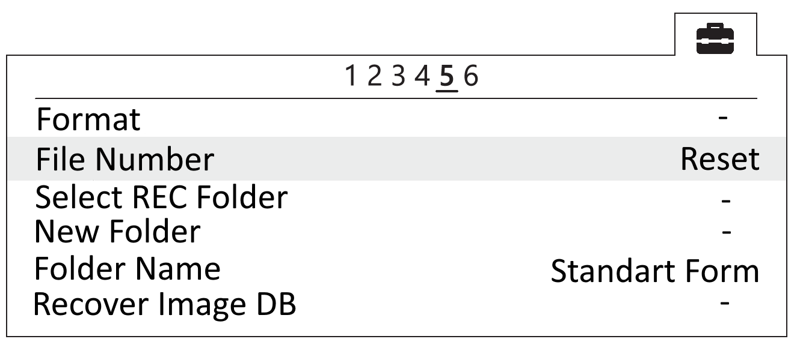

   Reset file number

**Format SD card**

1) Select **MENU →** |icon_bag| [Setup] **→ Format**

.. attention::  All data will be deleted!

Offsets coordinates
--------------------------------------------------------

The antenna of the geodetic receiver is located inside the UAV. The phase center is offset from the center point of the camera lens.
Offset value should be taken into account when you generate ortophotomaps and 3D models.

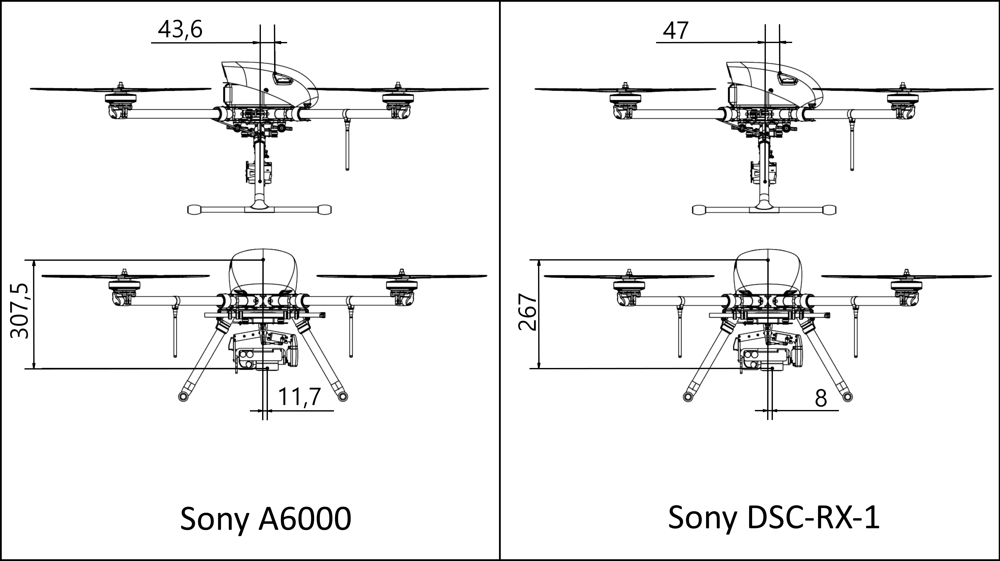

   Coordinates of GNSS Receiver for Sony A6000 and DSC-RX-1

.. csv-table:: 
   :header: "", "Sony A6000", "Sony DSC-RX-1"
   :align: center
   
   "**ΔX**", "0,012 м", "0,008 м"
   "**ΔY**", "0,044 м", "0,047 м"
   "**ΔZ**", "0,307 м", "0,267 м"

