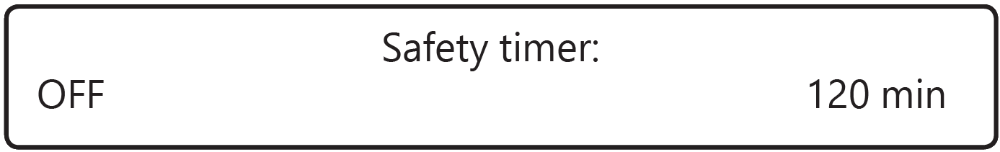
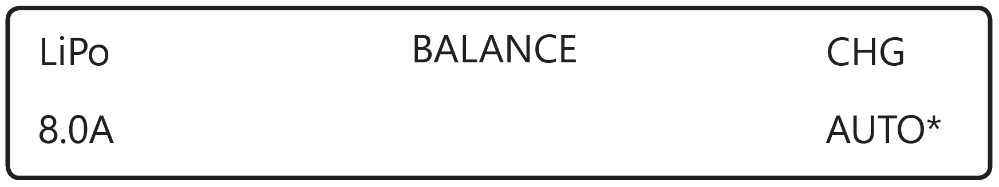
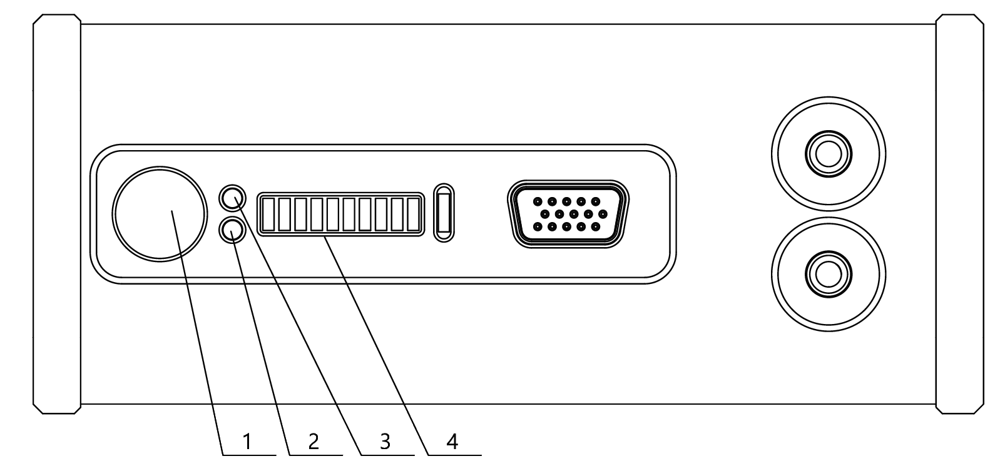

Charger and battery
=========================

.. csv-table:: **Parameters of the battery**
   
   "Guaranteed number of charge-discharge cycles", "50"
   "Upper charge voltage", "42 V"
   "Normal voltage", "~37 V"
   "Lower discharge voltage", "33 V"
   "Charging current", "<24 А"
   "Number of cells", "10"
   "Capacity", "16 000 mAh"
   "Shelf life", "1 year"

Safety requirements
----------------------

**Battery**

* Don't disassemble or deform the battery (don't drop or pierce).
* Don't heat the battery more than 60 degrees.
* Don't overcharge the battery (over 42V).
* Don't allow the battery discharge below 30V.
* Don't store battery fully discharged. For long-term battery storage (a month or more) it must be transferred to the **Storage** mode by the battery charger.
<<<<<<< HEAD
* Don't charge battery with currents more than charge limit (not more than 100% capacity level, it is recommended to charge 50% to extend a lifetime). Applying current which exceeds the limit will heat the battery over 60 °C. 
=======
* Don't charge battery by currents more than charge limit (no more than 100% of the capacity. We recommended to charge 50% of the capacity to extend the battery's life cycle). Current more than the limit will heat the battery over than 60 °C. 
>>>>>>> 9d77948ba697a2ef68cd930063eb489f3eadc365

.. attention:: Failure to follow the above instructions may result in fire or battery failure.

**Charger**

* The charger must be switched on before connect the battery to the charger.
* Cables and connectors must be inspected for damage before each use.
* Don't operate the charger in direct sunlight.
* Don't leave the charger unsupervised.

The charger is configured from the factory. Follow the instructions to config preset, if the settings are different.

Preset of the battery charger
----------------------------------------------------

Follow these steps to open the settings menu:

<<<<<<< HEAD
* In **PROGRAM SELECT** menu (main screen) press the **Batt type/Stop** button repeatedly, until **Settings** menu is selected;
=======
* In **PROGRAM SELECT** menu (main screen) press the **Batt type/Stop** button repeatedly, until charger's display shows **Settings** menu;
>>>>>>> 9d77948ba697a2ef68cd930063eb489f3eadc365

* Confirm by pressing the button **Start/Enter**;

* Use **Dec/Inc** buttons ;

Set these parameters in **Settings** menu:

* Disable charge time limit. Use **Dec/Inc** buttons to set **Safety timer**:

   Set Safety timer

**ON/OFF** trigger will be usable after you press **Start/Enter** button.  Use **Dec/Inc** buttons to select **OFF**, and long press **Start/Enter** until the settings on the screen stop blinking.

* Disable the rechargeable battery capacity limit. Use **Dec/Inc** buttons to select **Capacity cut-off**.

   Set Capacity cut-off

Press **Batt type/Stop** button to exit from **Settings** menu.

* Use buttons **Dec/Inc** to select **Lithium battery** in the **PROGRAM SELECT** (main screen). Conform it by pressing **Start/Enter** button. Set these settings after that:

   Settings

**AUTO** parameter sets number of cells (S) in automatic mode. Keep default parameters for other charger's settings.

You can power the charger from the grid or use a 12V car battery.

How to connect the battery to the charger
-----------------------------------------------------

* Plug in balance connector.
* Plug in power connector.

.. Attention:: Make sure that the car engine is running when you charge the battery from car battery. Otherwise, the battery will be discharged completely.

Battery indication
------------------------

   Battery's indicators and slots

Press the button (1) to see battery status. LED indicators (4) will display the level of charge with green LEDs and temperature inside battery with red LEDs (see the table). 
* Green LED (2) means battery voltage level (The battery is fully discharged, when the LED ingicators (4) are off. If All LED indicators are active - battery is fully charged).
* Red LED (2) indicates temperature level inside the battery.

.. csv-table:: **Battery's temperature indicators**
   :header: "Number of LEDs", "Glow mode", "Temperature, °С"
   

   "I", "blink", "< 5"
   "II", "blink", "5-10"
   "III", "blink", "10-15"
   "IIII", "shine", "15-20"
   "IIIII", "shine", "20-25"
   "IIIIII", "shine", "25-30"
   "IIIIIII", "blink", "30-35"
   "IIIIIIII", "blink", "35-40"
   "IIIIIIIII", "blink", "40-45"
   "IIIIIIIIII", "blink", ">=45"

The state LEDs are off and the level LEDs go out from right to left. It means countdown to the finish indication, in this time you can switch to the temperature maintenance mode (for «Arctic» battery), and you can insert the battery in the UAV to exchange information with on-board electronics.

.. Attention:: DO NOT connect an external power source to the battery when the display mode is activated.

.. csv-table:: **Key battery's state values**
   :header: "Type of battery", "Charged", "Half of charge", "Charge level is near zero", "Discharged", "Power is lose, Battery is broken"

   "10S 16Ah", "42,0 V", "37,0 V", "35,0 V", "33,0 V", ">25,0 V"

Battery discharge speed depends on throttle level, which changes due to weather conditions and flight route.
Set polygons with the minimum number of turns and the longest tacks. Use this recommendations to plane flights more effectively.

.. Attention:: The battery will begin to discharge faster, when the charge level drops to 35 V.

Lithium polymer (LiPo) battery recommendations on the use 
------------------------------------------------------------

The following rules must be taken into consideration to prevent dangerous situations:

* The battery must be stored in a warm place before launch for flights at a temperature lower than 0 °C. LiPo batteries can lose up to 30% of a capacity in cold conditions. You need to pay attention to this, when you're planning a flight task.

* The battery must be stored in a cool place before launch for a flights in temperature above 25 °C and stay away from direct sunlight. 

* Don't charge the battery just before flight. It should cool down. Charge the battery only in a cool place with no direct sunlight.

Storage and discharge
--------------------------------------------

**Storage**

If you don't plan to use the battery for more than 14 days, put it in a storage mode, 

Change **BALANCE CHG** mode to **STORAGE** to put battery in a storage mode. Check correct number of cells (10 Cells) and activate it by long press of **Start/Enter** button.

Batteries should be stored in a cool and dry place, without direct sunlight, at a temperature of 5 to 25 °C and a relative humidity of 80% without condensation.

Normal storage temperature — from 5 to 10 °С. 

Normal storage voltage: 38,5 V. 

Shelf life - 1 year.

**Discharge**

Check the number of cells is correct (10S) and select **DCHG** mode to disharge battery. Set charge current: 1 A (Charger set optimal discharge current automaticly)and activate it by long press  of **Start/Enter** button.

Battery recycling
--------------------

.. attention:: Don't throw LiPo batteries away with household trash. It may be dangerous for ecology. Send them to recycling points.

