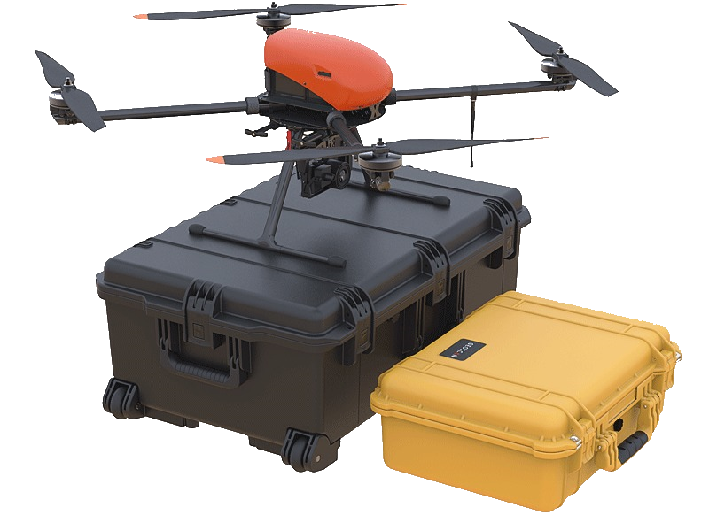

.. 101-doc documentation master file, created by
   sphinx-quickstart on Fri Dec 21 11:13:03 2018.
   You can adapt this file completely to your liking, but it should at least
   contain the root `toctree` directive.

Geoscan 401. Assembly and aplication
=====================================================

**General information**

Geoscan 401 – multifunctional complex, that included multirotor unmanned aerial vehicle (UAV) and ground control system (GCS).

**Kit**

* Geoscan 401 unmanned aerial vehicle (UAV) 
* UAV transport container
* Payload: *

   * customized Sony А6000 camera;
   * customized Sony DSC-RX1 camera;
   * gyro-stabilized optical-electronic system with FullHD videocamera;
   * gyro-stabilized optical-electronic system with thermal imager 640x480;
   * digital broadband video receiver;
   * onboard geodetic GNSS receiver Topcon with antenna (L1-L2, GPS/GLONASS/BeiDou);
   * quantum magnitometer Geoscan QM-Rb-1.

* 37 V LiPo battery 
* Left rotation propeller  - 2 PCs
* Right rotation propeller - 2 PCs
* Charge station with transport case
* Ground Control Station (GCS) based on laptop with software *
* Table for GCS *
* Mouse
* RCL modem
* RCL modem's antenna
* Pole for RCL modem
* SDHC card 64 Gb - 2 PCs *
* SD card 4 Gb - 2 PCs *
* Wrench, 13 mm
* Nut for a propeller fixation (right hand thread) - 2 PCs
* Nut for a propeller fixation (left hand thread) - 2 PCs
* Washer for a propeller fixation - 4 PCs
* USB cable
* GCS “Video” *
* Spare parts and accessories:

  * Left rotation propeller;
  * Right rotation propeller;
  * Nut for a propeller fixation (right hand thread) - 2 PCs;
  * Nut for a propeller fixation (left hand thread) - 2 PCs;
  * Washer for a propeller fixation - 4 PCs;
  * RCL modem's antenna.

`*` - *Depends on equpment*

**Technical parameters**

+--------------------------------------------+---------------------------------------------------------------------------+
|                Type of UAV                 |                                 quadcopter                                |
+--------------------------------------------+---------------------------------------------------------------------------+
|                   Engine                   |                    electric, brushless - 4 PCs                            |
+--------------------------------------------+---------------------------------------------------------------------------+
|                  Battery                   |                                 37 V LiPo                                 |
+--------------------------------------------+---------------------------------------------------------------------------+
|                Launch/Landing              |              verticaly, in automatic mode, from/to 5 m area               |
+--------------------------------------------+---------------------------------------------------------------------------+
|                Flight duration             |                            up to 1 h                                      |
+--------------------------------------------+---------------------------------------------------------------------------+
|                 Max wind speed             |                                  12 m/s                                   |
+--------------------------------------------+---------------------------------------------------------------------------+
|                 Speed of flight            |                             0-50 km/h                                     |
+--------------------------------------------+---------------------------------------------------------------------------+
|            Min safe flight altitude        |                                  25 m                                     |
+--------------------------------------------+---------------------------------------------------------------------------+
|       Max flight altitude over start point |                                 500 m                                     |
+--------------------------------------------+---------------------------------------------------------------------------+
|                Max takeoff weight          |                                9,3 kg                                     |
+--------------------------------------------+---------------------------------------------------------------------------+
|               Max payload mass             |                                2,5 kg                                     |
+--------------------------------------------+---------------------------------------------------------------------------+
|    Preparation time before takeoff         |                                 5 min                                     |
+--------------------------------------------+---------------------------------------------------------------------------+
|                                            |                             folded  70х25х20 cm                           |
|         UAV's overall dimensions           +---------------------------------------------------------------------------+
|                                            |                            unfloded 150х150х43 cm                         |
+--------------------------------------------+--------------------------------------+------------------------------------+
|                                            |      2 cm/pix quality                |    0,95 km²                        |
|                                            +--------------------------------------+------------------------------------+
|     Photo shooting area in one flight      |      3 cm/pix quality                |    1,4 km²                         |
|                                            +--------------------------------------+------------------------------------+
|                                            |      5 cm/pix quality                |    2,1 km²                         |
+--------------------------------------------+---------------------------------------------------------------------------+
|                                            |                                -20 to +40 °C                              |
+        Operating temperature range:        +---------------------------------------------------------------------------+
|                                            |                        -20 to +40 °C  ("Arctic" battery)                  |
+--------------------------------------------+---------------------------------------------------------------------------+

**Maintenance**

After each flight, visually inspect UAV for a damage.

If a propellers are damaged, you can replace it yourself using spare parts and tools from the kit.

If structural damage to the airframe or systems is detected, contact `Geoscan support <https://www.geoscan.aero/en/support>`_.

After 80 flights it is recommended to send your UAV to the manufacturer for inspection and maintenance.

**Storage**

Geoscan 401 complex (without battery) are recommended to be stored in a transport containers in dry rooms at a temperature of 5 to 25 °C and relative humidity not more than 80% without condensation. Shelf life - 2 years.

Batteries should be stored in a cool and dry place, without direct sunlight, at a temperature of 5 to 25 °C and a relative humidity of 80% without condensation. The optimum voltage level when placing the battery to storage: 38,5 V. Shelf Life - 1 year.

.. toctree::
   :maxdepth: 2
   :caption: Content:

   reference
   precautions
   uav
   nsu
   camera
   charger
   planner
   launch
