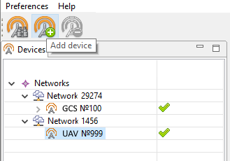
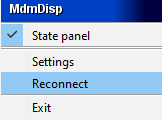

Geoscan Planner
==============================

Preset
-----------------------------------

1) Connect RCL modem with the notebook.
2) Turn UAV power.
3) Run application **MdmDisp**.

The antenna icon and the number of connected UAV's on the screen's lower right corner are displayed.

   MdmDisp program indicator

3.1 At the first time you need to configure connection with UAV.

Run **NetTopology**:

* Click **Search new devices** button.

   Search button

The program shows a list of detected modems.

.. note:: The button is fixable. It should be pressed again to stop searching.

* Choose UAV №xxx and click **Add device** button.

   Add device

The program saves the list of added devices.

Just run **MdmDisp** and make sure that the connection is successful on next time.

You can reconnect the RCL modem by clicking **Reconnect** in context menu, if UAV is not detected.

   MdmDisp сontext menu

4) Run the **Geoscan Planner** program.
5) Enter your login and password.
6) In context menu **Flight** select **Connect to the UAV – Search...** for a searching UAV's.

.. figure:: _static/_images/planner3.png
   :align: center
   :width: 500

   Connect to the UAV

7) Select type of connection **MdmDisp**. Set **IP-address** *localhost*. In **Vehicle** list set **UAV - Port 2**.

   Connect to the UAV

.. note:: The program saves UAV's automaticly. Next time click **Connect the UAV** on the toolbar for reconnect the UAV. The receiver will automatically detect the coordinates and display the UAV location on the map. The telemetry panel (left) and the instrument panel (right) will shown in program window.

   Connect to the UAV

Flight task creating
----------------------------------------

1) Create **New project**.

   New project creation

2) Set a project name, shooting parameters, UAV and camera.

   Project parameters

Areal surveying
-------------------------------------------
Areal surveying is an aerial photography of polygons. Polygon is an area, bounded by polygon. The operator sets the vertices of the polygon, and the program automatically calculates the route for UAV.

1) Click on **Create areal surveying** button on the toolbar.

   Areal surveying creation

2) By single mouse clicking specify the angular points of the research site. The program automatically calculates the route for bypassing the polygon.

   Areal surveying example

Adding and removing polygon vertices.
__________________________________________

You can add vertices to the completed polygon.

1) Hold the left mouse button and move the middle point of the polygon side.

   Adding the vertex

The vertex will be created automatically.
In a floating window near the vertex will display its coordinates.

   Result of adding a vertex

To remove vertex:

1) Click right button on vertex.
2) In menu select **Delete vertex**.

   Delete vertex

Changing the direction of the route lines
____________________________________________

The necessary of optimizing polygon "by the direction" occurs quite often, for example, if the force and direction of the wind are unfavorable at the site of work (strong wind along the lines of the overflight above the polygon).

1) Right-click on the polygon area.
2) Select **Optimization by “direction”**.

   Optimization by direction

One of the vertices of the polygon will be highlighted and a rotation marker will appear on it to set the direction.

   Adjusting the direction of flight

As a Result, there will be a new route to fly around the area in the specified direction.

   New flight route

Change start point
________________________

To change the polygon entry point, follow these steps:

1) Select polygon

   Selected polygon

2) Right-click to select the point where you want to start circling the area.
3) In menu select **Make start point here**.

   Change the polygon entry point

A marker |flag| appears at the selected entry point.

Linear surveying
---------------------------
Linear aerial photography is performed in order to survey linear extended objects, such as: rivers, roads, power lines, oil pipelines.

1) Click **Create linear surveying** button on the toolbar.

   Linear surveying creation

2) Single-click to specify the route of traversing the extended object by turning points. The program will automatically draw lines of flight.

   Example of linear surveying

Flight by points
-------------------
**Create flight by points** can be used for exploring territories or flying around high-rise objects.

1) Click **Create Flight by points** button on the toolbar.

   Create flight by points button

2) By single mouse clicks specify flight by points route.

   Set flight by points route

.. note::  If it needs change settings of photo mode in **Properties** toolbar.

* You can also set the hover properties in the point using the context menu of the point. Select the option **Set hover at point** and specify the time in seconds.

Waiting point
------------------------
Waiting point serves to hold the indicated point at the specified altitude during
the specified time interval.

1) Click **Create waiting point** button on the toolbar.

   Waiting point creation

2) Click and specify the point, where a waiting should take place.

   Waiting point on a map

The UAV will hold the point for the specified time at the specified height, and then go along the planned route.

In expert mode (see full Geoscan Planner instructions) properties may be changed:
setting an altitude of the waiting point, the waiting time and activation of the
wind measurement function.

When **Wind measure** is activated, the duration is automatically set to 15. The last point will turn yellow. The UAV flies in a circle, taking into account wind measurements.

If you use infinite waiting the UAV will hold the point, until a low battery trigger runs automatic return. Color of the waiting point will changed to deepest blue. 

.. attention:: It is recommended to set a point of waiting with the wind measurement before each flight element at an altitude of the flight element. Taking into account the wind measurement data, UAV will go smoother along the route.

Panoramic survey
---------------------
Use **Create panoramic photos** button to make photo series for panorama.

1) Click **Create panoramic photos** button on the toolbar.

   Create panoramic photos button

Shooting is carried out in full rotation in azimuth and in the range from 0 to 80 in tilt by default. If it needs, you can change the parameters of the panoramic shooting in the **Properties** tab of expert mode (see full Geoscan Planner instructions).

Landing point
------------------
Use **Create landing point** command to set landing point different from start position. 

In the absence of a specified landing point in flight task project, UAV automatically returns to the takeoff point where it performs landing.

1) Click **Create landing point** button on the toolbar.

   Create landing point button

2) Set UAV's landing point by single mouse click on a map.

Pre-launch preparation
----------------------------

1) Click **Start preparing** button.

   Start preparing button

Follow the instructions of the Start preparing Wizard (most tests are runned automatically).
Set the offline flight time (without connection between GCS and UAV) and set return's height after finishing flight mission or end of autonomic flight. 

.. attention:: The return height must be  must ensure that there are no barriers on the flight route.

Flight
----------------------------

1) Click on **Start** button.

   Start button

Make sure that nothing prevents the rotation of the propellers and confirm the engines start.

   Starting engines approval

Autopilot will check state of the engines. Confirm takeoff after that.

   Start confirmation

UAV will take off.

.. note:: The UAV performs flights in automatic mode, however, operator must observe the process of flight. Permanent radio link is not necessary for successful performing of flight task.

Cancel
----------
**Cancel** command directs the UAV to start point. UAV will start land when be opposite the starting point.

1) Click **Cancel** button.

   Cancel button

Land
---------
Use **Land** command to descent and immediate landing.

1) Click on **Land** button.

   Land button

.. attention:: The automatic deceleration during land is triggered at a barometric altitude, respectively, it is not recommended to specify the landing point in a place that varies greatly in relief from the take off point.

Guided flight
---------------------
**Guided flight** allows to send the UAV to the specified point on the map (the
altitude should indicated).
Once the specified point is reached, the UAV will hold to this point until the
operator intervenes in the flight task, or until the lack of battery charge triggers
automatic return.

1) Click **Guided flight** button.

   Guided flight button

2) Specify a point on the map and set the height.

   Set the height of the guided flight

The UAV will start holding the indicated point, when the point is reached.

   Guided flight example

Semi-automatic control
---------------------------

You can activate manual control mode after pre-launch preparation and take off.

1) Click **Semi-automatic control** button.

   Semi-automatic control button

.. attention:: Flight mission is paused when manual control mode is on. the mission will continue after remote control deactivation. 

Semi-automatic control mode will be activated.

Use keyboard buttons or buttons in semi-automatic control's window to set flight direction.

   Semi-automatic control window

* **W** – fly forward 
  
* **A** — tilt left
  
* **S** — flight back
  
* **D** — tilt right 
  
* **T** — Up (rising)
  
* **G** — Down (desending)
  
* **[** – rotation to the left
  
* **]** – rotation to the right

