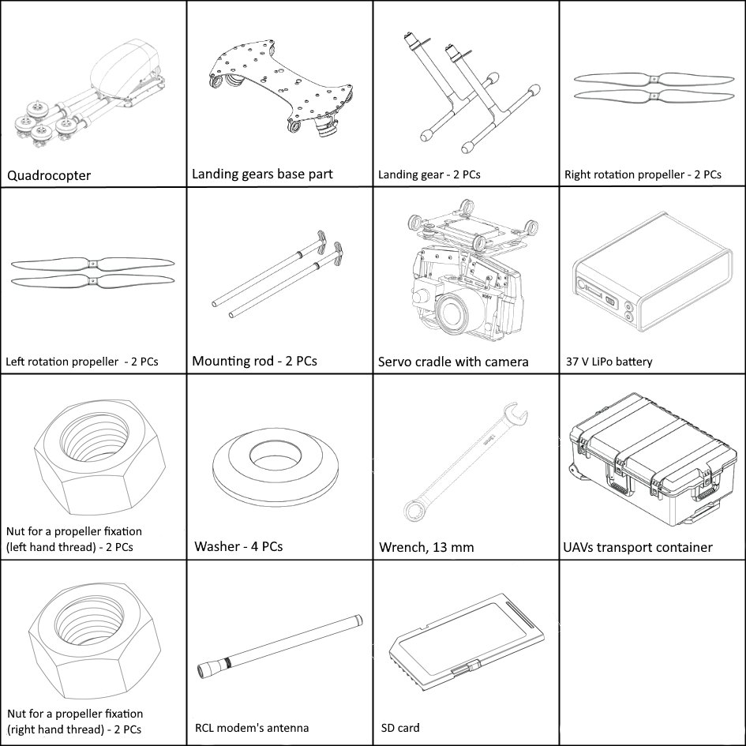

UAV
============

Parts
---------------------------

Assembly 
-------------

1) Take the landing gears base part and landing gears from the UAV's transport container.
2) Put landing gears in the landing gears base part tubes.
3) Tighten connecting nuts on landing gears by hands.
4) Fix nuts position by elastic fixators.

.. figure:: _static/_images/asmbl1.png
   :width: 400
   :align: center

   Installation and fixation of the landing gears

5) Take the quadcopter from the UAV's transport container.
6) Remove a protective transport elements.
7) Take the quadcopter's frame arms out to the sides.

   Quadcopter's assembly

8) Move frame arms nuts to the quadcopter's frame central part and tighten it.

   Quardcopter's nuts moving

.. attention:: Make sure that the nuts are covered frame pins.

9) Put the quadcopter on landing gears base part.

* Frame loops must be connected with landing gear's loops.

* Take the servo cradle and position it under the quadcopter's frame. The frame loops must be connected with servo cradle's loops. (see the picture). The camera lens should be directed in the direction of the slope of the quadcopter fairing.

   Connection of the parts

* Put a mounting rods in loops on the side of the red seals.

   Connection of the parts

.. attention:: Make sure that, the rods are fully puted (Rod's rings must be puted into red seals).

10) Install propellers on the shafts of the motors. The markings on the frame arms and propellers must be the same (orange and white marks on the arms and on the propellers ends).

* Put the washers and tighten the nuts without much effort.

.. attention:: Use a left hand nuts for arms and propellers with orange marks, and right hand nuts for white marks.

.. figure:: _static/_images/asmbl6.png
   :width: 400
   :align: center

   Fixation of the propellers

.. attention:: Before each start make sure that all propellers are not damaged. Do not use worn, cracked or damaged propellers.

11) Put payload's connection cable (if payload connects with UAV) in quardcopter's slot.

.. figure:: _static/_images/asmbl11.png
   :width: 400
   :align: center

   Connection of the payload cable

12) Screw RCL antenna in quadcopter's arm pin.

.. attention:: Make sure that the pin is clear.
 Clear pin by using alcohol-soaked lint-free cloth.
.. attention:: Do not turn on UAV power without CRL antenna. This may damage the receiver.

.. figure:: _static/_images/asmbl7.png
   :width: 400
   :align: center

   Connection of the RCL antenna

13) Eject payload's memory cards, format and insert them back. *

`*` - *Depends on equpment*

.. figure:: _static/_images/asmbl10.png
   :width: 400
   :align: center

   Instaling memory card in UAV's slot (kit with GNSS receiver).

14) Install the battery in battery slot until it stops (Battery pins must be on the left side looking forward).

   Installing of the battery

15) Fix the battery by textile clasp.
